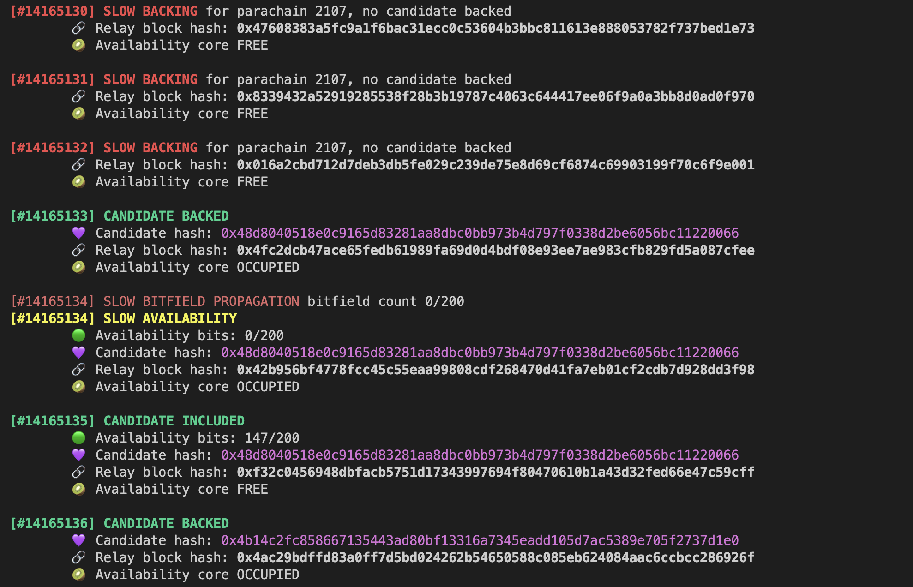

# Polkadot introspector

**IMPORTANT NOTE: WORK IN PROGRESS!** Do not expect this to be working (or supported).

The introspector is a collection of tools for monitoring and introspection of the Polkadot or other substrate based blockchains
via a set of tools (for example, [subxt](https://github.com/paritytech/subxt/)).

Depending on the tool, the data source and output might differ. For examples of how this data can be visualised in Grafana, please see the [Grafana dashboards](grafana/README.md) section.

## Building

It is mandatory to specify which `Runtime` the build will target. Currently `Polkadot Introspector` can only build for a single runtime version by enabling one of the features:
- `polkadot` (supports both Kusama and Polkadot)
- `rococo` (supports Rococo and Versi test networks)

`cargo build --profile=release --features=polkadot`

These features will select which metadata to use for decoding block data.

## Updating or supporting a new `Runtime`
Sometimes the `Runtime` version deployed on a network might be newer and incompatible to the metadata
bundled in the repo. We can use `subxt` CLI to bring the `Polkadot Introspector` metadata up to date.

Example for Versi:
`cargo run --release -p subxt-cli -- metadata --format bytes --url wss://versi-rpc-node-0.parity-versi.parity.io:443 > new_metadata.scale`

Use the output file to replace the older in the `assets` folder then rebuild.

## Tools available

* [Block time monitor](#block-time-monitor) - display the current block time in the substrate based network
* [KVDB tool](#kvdb-introspection-tool) - inspect key-value database used by parachains or the relay chain
* [Parachain commander](#parachain-commander) - Parachain progress monitoring and debugging utility

### Parachain commander
A parachain progress monitor and debugger which uses `on-chain` data to trace parachain candidates during backing and inclusion.

The tool documentation is available [here](introspector/src/pc/README.md).

This is how it looks when it's running:



### Block time monitor

In this mode, introspector monitors block production time via different RPC nodes. The tool runs in either CLI or Prometheus mode. CLI mode outputs
live ASCII charts on the terminal while Prometheus mode exposes an endpoint for scraping the observed block times.

```
cargo run --release --features=polkadot -- block-time-monitor \
    --ws=wss://westmint-rpc.polkadot.io:443,wss://wss.moonriver.moonbeam.network:443,wss://statemine-rpc.polkadot.io:443,wss://ws.calamari.systems:443,wss://rpc.polkadot.io:443,wss://kusama-rpc.polkadot.io:443,wss://api.westend.encointer.org:443 \
    cli
```

### KVDB introspection tool

The tool documentation is available [here](kvdb/README.md).